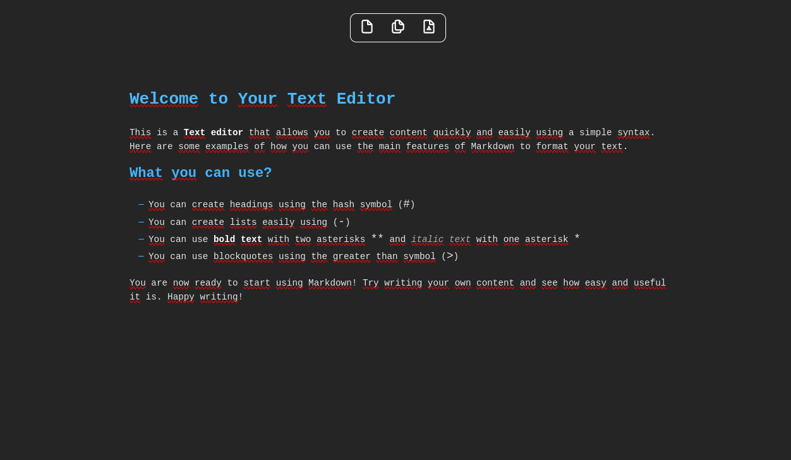

# Just - A Minimalistic Text Editor

Welcome to **Just**, a minimalistic text editor designed for quick note-taking and simple markdown formatting. Just is easy to use and perfect for jotting down your thoughts, ideas, or notes quickly.



## Features

Just supports a few essential Markdown features to help you format your notes:

- Bold text
- Italic text
- Blockquotes
- Headings

### Headings

Create headings using the hash symbol (`#`). Here are some examples:

```markdown
# Heading 1

## Heading 2

### Heading 3
```

### Text Styles

Apply bold and italic styles to your text:

- Bold: Surround the text with two asterisks `**` or two underscores `__`.
- Italic: Surround the text with one asterisk `*` or one underscore `_`.

### Lists

Create unordered lists and nested lists easily:

```markdown
- List item
- Another list item
  - Sub list item
  - Another sub list item
```

### Blockquotes

Add blockquotes to highlight important text or quotes:

```markdown
> "This is a blockquote. Use blockquotes to emphasize important notes."
```

## Contributing

We welcome contributions to improve Just. If you have any suggestions, issues, or would like to contribute, please follow these steps:

1. Fork the repository.
2. Create a new branch for your feature or bugfix.
3. Make your changes.
4. Submit a pull request with a detailed description of your changes.

---

Thank you for using Just! I hope it helps you take notes quickly and efficiently.

_Happy note-taking with Just!_
